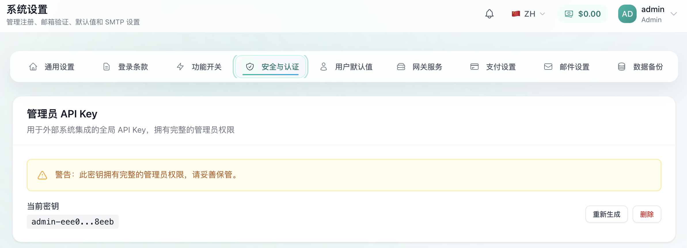
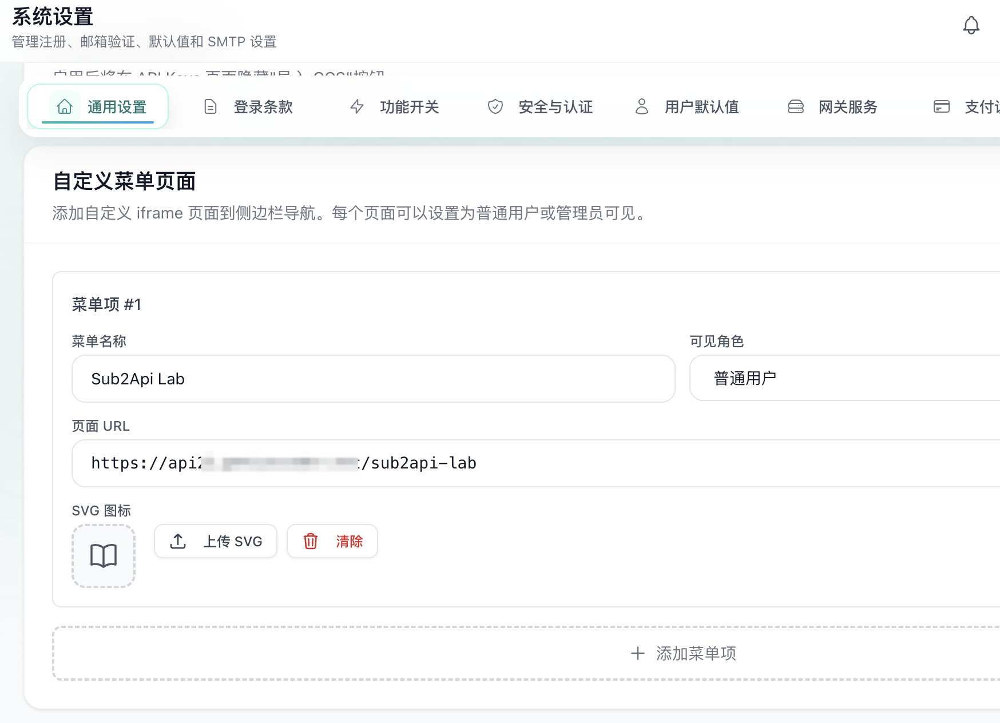
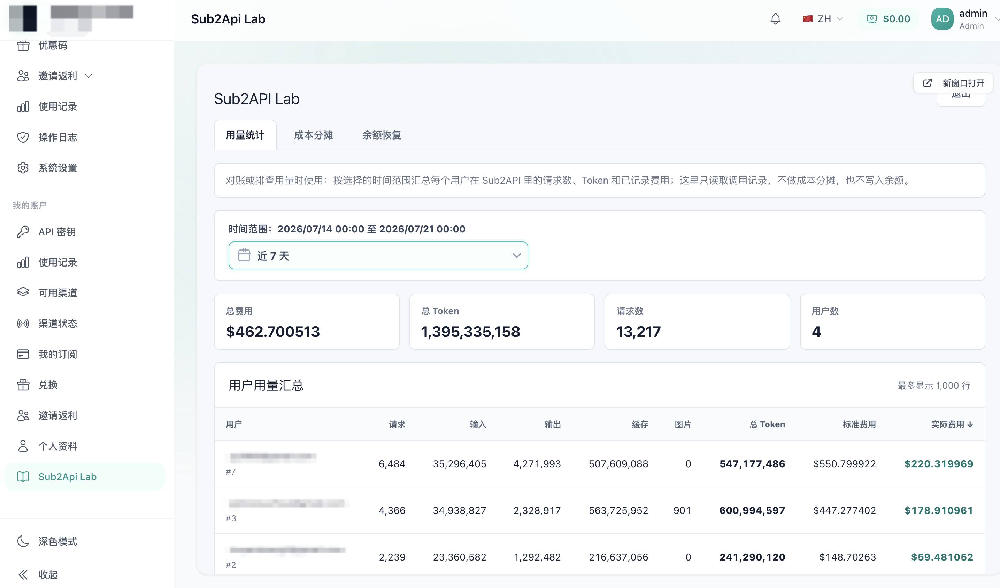

# Sub2API Lab

Sub2API Lab (Sub2API拼车助手) 是基于 [Sub2API](https://github.com/Wei-Shaw/sub2api) 的独立月度对账工具，适合 Codex 多人拼车场景。`20x` 等高额度方案的单位成本通常低于 `1x` 或 `5x`，但单人往往用不完；多人拼车可以更充分地利用额度，但每个人的实际用量不同，平均分摊并不公平。本工具支持按系统余额、实际费用或标准费用统计每个用户的消耗基准，再按比例分摊当月的实际采购总成本。

## 功能概览

| Tab | 使用时机 | 功能 | 数据访问 |
| --- | --- | --- | --- |
| 额度趋势 | 日常查看或月底复盘时 | 按配置时区的每个整点展示各上游账号 7 天使用率折线，并列出检测到的重置 | 读取 Sub2API `accounts.extra` 的小时快照 |
| 用量统计 | 日常查看或排查时 | 按时间范围汇总每位用户的请求数、各类 Token、标准费用和已记录费用 | 读取 `usage_logs` 和 `users` |
| 额度分析 | 日常查看账号窗口和本地用量时 | 查看当前账号窗口、模型用量、用户 Token 与费用分析 | 读取原始 Sub2API 数据库 |
| 成本分摊 | 每月结算时 | 按系统余额、实际费用或标准费用计算统计基准，再按比例分摊实际采购总成本 | 读取 `users.balance`、`usage_logs` 和 `accounts` |
| 余额设置 | 每月开始使用前 | 将所选账号的系统余额设置为当月额度 | 读取 `users.balance`，通过 Admin API 写入 |

## 成本分摊口径

“实际采购总成本”是本月购买 Codex 订阅或相关账号实际支付的金额。成本分摊页面不会直接写入 Sub2API，只根据所选统计口径算出每个用户的分摊比例和应承担成本。

成本分摊支持三种统计口径：

| 统计口径 | 统计基准 | 是否需要月初设置余额 | 适用场景 |
| --- | --- | --- | --- |
| 系统余额 | `max(初始系统余额 - 当前系统余额, 0)` | 需要 | 账号统一发放系统余额，月底按余额消耗分摊 |
| 实际费用 | `usage_logs.actual_cost` 汇总值，已包含 Sub2API 分组倍率 | 不需要 | 希望按 Sub2API 实际扣除口径分摊 |
| 标准费用 | `usage_logs.total_cost` 汇总值，按模型官方价格计算 | 不需要 | 希望不受分组倍率影响，按模型标准成本口径分摊 |

只有“系统余额”口径依赖初始系统余额。使用这个口径时，需要先在「余额设置」里把参与账号设置到同一个初始系统余额，例如 `5000`；月底再用 `初始系统余额 - 当前系统余额` 得到本月系统消耗。未勾选的账号会显示在表格里，但统计基准按 `0` 处理，不参与比例分摊。系统余额口径不展示标准费用和实际费用，因为这两个字段需要开始时间、结束时间和 `usage_logs` 统计范围。

“实际费用”和“标准费用”口径直接汇总 `usage_logs`，不需要月初设置余额，也不需要知道账号当前系统余额。实际费用按 Sub2API 分组倍率后的 `actual_cost` 统计；标准费用按模型官方价格对应的 `total_cost` 统计。

实际费用和标准费用口径可以设置开始时间、结束时间和上游账号过滤。上游账号不选择时表示不过滤；选择多个上游账号时，只统计这些上游账号产生的用量成本。成本分摊页面的 URL tab 为 `?tab=allocation`，余额设置页面的 URL tab 为 `?tab=balance`。

页面里的日期和时间按 `SUB2API_LAB_TIMEZONE` 解释，默认是 `Asia/Shanghai`，也就是北京时间。用户在页面输入的开始时间、结束时间，以及“今天”“本月”“上月”等快捷范围，都会先按这个时区计算边界，再转换为绝对时间点查询 `usage_logs.created_at`；数据库查询本身使用 `created_at >= start` 且 `created_at < end`。

```text
账号分摊比例 = 账号统计基准 / 所选账号统计基准总额
账号应承担成本 = 账号分摊比例 * 实际采购总成本
```

例如，三位成员的统计基准分别占 `50%`、`30%` 和 `20%`，实际采购总成本为 `1200` 元，则三人分别承担 `600` 元、`360` 元和 `240` 元。

### 系统余额口径的月度流程

1. **月初设置余额**：在「余额设置」中，为所有参与本月拼车的账号设置相同且充足的初始系统余额，例如 `5000`。
2. **月内正常使用**：成员通过 Sub2API 使用 API，Sub2API 按自身计费规则从各账号的系统余额中扣除费用。
3. **月底分摊成本**：在「成本分摊」中选择“系统余额”，填写初始系统余额和实际采购总成本。Sub2API Lab 根据每个所选账号的当前系统余额计算系统消耗，再按消耗比例分摊实际成本。
4. **下月开始前设置余额**：确认分摊结果后，在「余额设置」中将参与账号的系统余额设置为下个月的统一额度。

使用系统余额口径时，必须先完成成本分摊，再设置下月余额。余额设置会覆盖当前系统余额，而当前系统余额是计算本月系统消耗的依据。

## 快速开始

环境要求：Node.js `20.19+` 或 `22.12+`，以及可访问的 Sub2API PostgreSQL 数据库。

```bash
npm ci
cp .env.example .env.development
```

编辑 `.env.development`，至少填写 `SUB2API_LAB_AUTH_USER`、`SUB2API_LAB_AUTH_PASSWORD`、`DATABASE_URL` 和 `DATABASE_URL_SUB2API`，然后启动服务：

```bash
npm run dev
```

本地默认访问地址为 `http://127.0.0.1:9100`。配置了 `SUB2API_LAB_BASE_PATH` 时，请从对应子路径访问。

## 配置说明

配置项以 [.env.example](.env.example) 为准。开发环境使用 `.env.development`，生产环境使用 `.env.production`；这两个文件已被 Git 忽略，不要提交真实账号、密码或密钥。

| 变量 | 必填 | 用途 |
| --- | --- | --- |
| `SUB2API_LAB_AUTH_USER` | 是 | Sub2API Lab 登录用户名，由部署者设置 |
| `SUB2API_LAB_AUTH_PASSWORD` | 是 | Sub2API Lab 登录密码，由部署者设置 |
| `DATABASE_URL` | 是 | Sub2API Lab PostgreSQL 连接串；也是 TinyDB migration 的目标库 |
| `DATABASE_URL_SUB2API` | 是 | Sub2API 主库 PostgreSQL 连接串，用于读取 usage、账号和余额 |
| `SUB2API_LAB_HOST` | 否 | 监听地址，默认为 `127.0.0.1` |
| `SUB2API_LAB_PORT` | 否 | 监听端口，默认为 `9100` |
| `SUB2API_LAB_BASE_PATH` | 否 | 挂载子路径，默认使用根路径 |
| `SUB2API_LAB_TIMEZONE` | 否 | 页面时间和统计边界使用的时区，默认为 `Asia/Shanghai` |
| `SUB2API_BASE_URL` | 否 | Sub2API Admin API 地址 |
| `SUB2API_ADMIN_API_KEY` | 否 | 余额设置使用的管理员 API Key；留空时无法使用余额设置功能 |

`DATABASE_URL` 格式如下：

```dotenv
DATABASE_URL=postgresql://用户名:密码@数据库地址:端口/sub2api_lab?sslmode=disable
DATABASE_URL_SUB2API=postgresql://只读用户名:密码@数据库地址:端口/sub2api?sslmode=disable
```

额度趋势使用独立的 `sub2api_lab` 数据库。首次部署时由数据库管理员创建该数据库，并让 `DATABASE_URL` 使用的用户可以连接和写入：

```sql
CREATE DATABASE sub2api_lab OWNER Lab 应用数据库用户;
GRANT CONNECT ON DATABASE sub2api_lab TO Lab 应用数据库用户;
```

切换到 `sub2api_lab` 后执行应用迁移：

```bash
npm run build
npm run db:migrate
```

迁移使用 `@xiaomingio/tiny-db-migrate`，会创建 `sub2api_lab_quota_snapshots` 表。应用运行时每个配置时区的整点读取 Sub2API `accounts.extra`，将 7 天使用率保存为小时快照，不调用 Sub2API 额度刷新接口。应用启动不会自动执行迁移，数据库管理员应先完成迁移，再启动应用。

登录凭据属于 Sub2API Lab，与 Sub2API 用户账号无关。未登录访问会进入登录页；生产环境请使用独立的强密码。

## 管理员 API Key（可选）

只有余额设置需要管理员 API Key。进入 Sub2API 管理后台的「系统设置 → 安全与认证 → 管理员 API Key」，点击“重新生成”，然后将密钥填入 `SUB2API_ADMIN_API_KEY`。

Sub2API Lab 不直接更新 `users.balance`。余额设置会调用 `POST /api/v1/admin/users/:id/balance`，并使用 `operation: "set"` 设置目标余额。Sub2API 会在写入余额的同时记录调整历史并清理缓存；直接更新数据库只会改变表中的数值，可能让余额缓存和调整记录与数据库不一致。



管理员 API Key 拥有完整管理员权限，只应保存在真实 env 文件或部署平台的密钥配置中。

## 在 Sub2API 中配置入口（可选）

Sub2API 可以在「系统设置 → 通用设置 → 自定义菜单页面」中添加 iframe 页面。菜单名称填写 `Sub2API Lab`，页面 URL 填写部署后的 Lab 地址，例如 `https://your-domain.example/sub2api-lab`，再按需要设置可见角色。



保存后，可以直接从 Sub2API 侧边栏进入 Sub2API Lab。



## 本地开发

项目使用 `Fastify API + Vite + React`。Fastify 负责登录鉴权、数据库读取、静态资源托管和余额设置，React 负责浏览器端管理界面。

| 命令 | 用途 |
| --- | --- |
| `npm run dev` | 构建前端资源并以源码 watch 模式启动本地服务 |
| `npm run db:migrate:dev` | 使用 `.env.development` 执行本地数据库迁移 |
| `npm test` | 运行成本分摊和 Sub2API 写入请求测试 |
| `npm run typecheck` | 检查服务端、客户端和测试 TypeScript 类型 |
| `npm run build` | 构建前端资源并编译服务端代码 |
| `npm run start` | 使用 `.env.development` 启动已构建的 `dist/server.js` |

## 生产部署

先根据 [.env.example](.env.example) 准备 `.env.production`。可以使用 [TinyShip](https://github.com/xiaomingio/tinyship-js) 部署，也可以手动执行同样的 `rsync + PM2` 流程。

### 使用 TinyShip

`tinyship.config.yml` 使用通用 SSH 别名 `sub2api-lab-production`。在本机 `~/.ssh/config` 中将它映射到自己的服务器：

```sshconfig
Host sub2api-lab-production
  HostName your-server.example.com
  User deploy
  IdentityFile ~/.ssh/your-key
```

TinyShip 会同步构建产物和 `.env.production`，安装生产依赖，再根据 `ecosystem.config.cjs` 启动或重载 PM2 服务。

```bash
npm run build
npm run deploy:validate
npm run deploy:preflight
npm run deploy:sub2api-lab
```

### 自行部署

目标主机需要安装 Node.js、PM2 和 `rsync`，并准备好可写的 `/opt/sub2api-lab` 目录。先在本地构建：

```bash
npm ci
npm run build
```

同步运行文件：

```bash
rsync -az --delete dist/ sub2api-lab-production:/opt/sub2api-lab/dist/
rsync -az package.json package-lock.json tiny-db-migrate.config.yml db/ ecosystem.config.cjs .env.production \
  sub2api-lab-production:/opt/sub2api-lab/
```

登录目标主机，安装生产依赖并启动服务：

```bash
ssh sub2api-lab-production
cd /opt/sub2api-lab
npm install --omit=dev
pm2 stop sub2api-lab
npm run db:migrate
pm2 startOrReload ecosystem.config.cjs --only sub2api-lab
pm2 save
```
